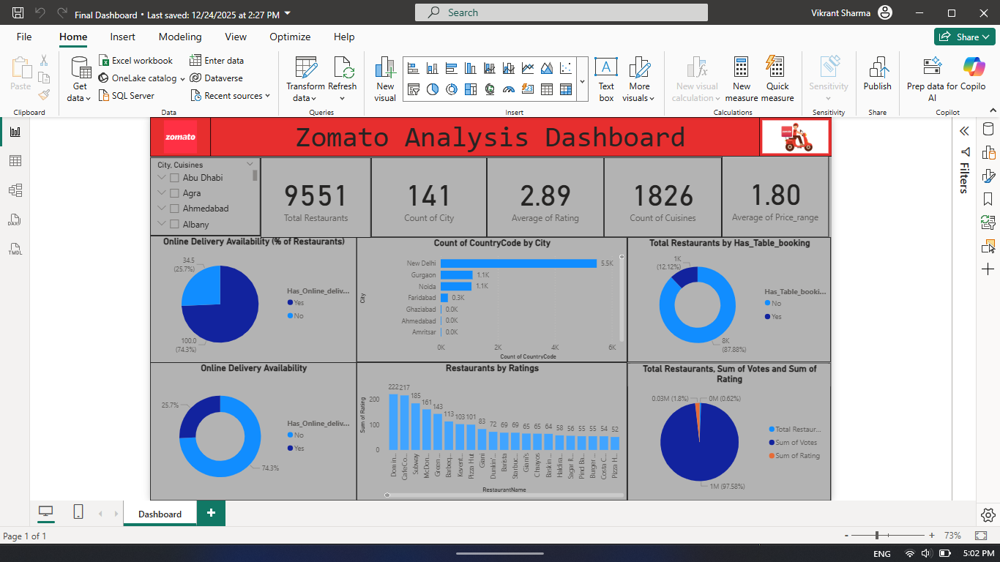
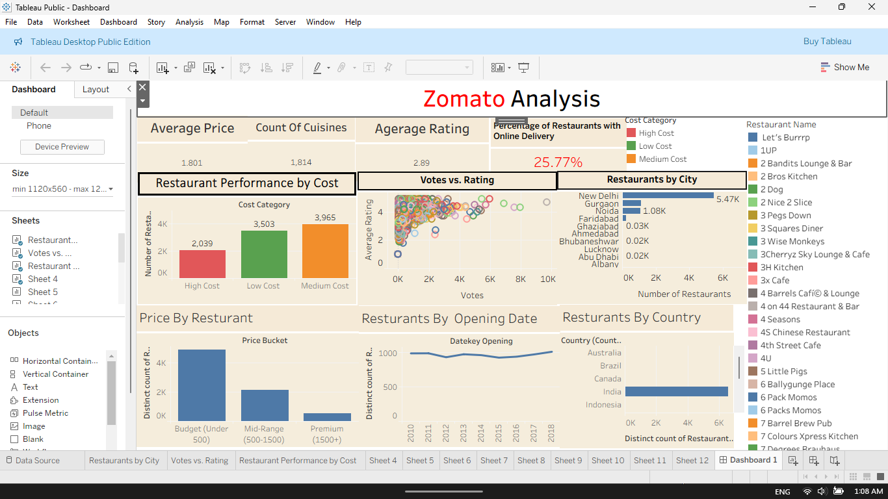
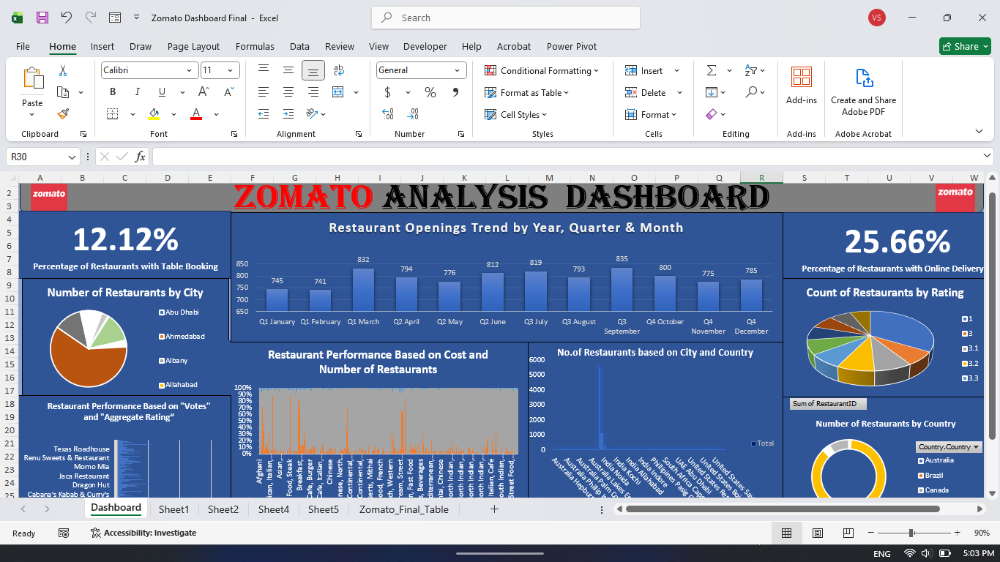

# Zomato_Restaurant_Analysis
Comprehensive analysis of Zomato restaurant data. Features 18+ KPIs and interactive dashboards built with Excel, Power BI, Tableau, and MySQL to identify market trends, pricing strategies, and customer preferences.

# 🍴 Zomato Restaurant Insights & Analytics
**End-to-End Market Analysis | Excel, Power BI, Tableau, MySQL**

### 📊 Project Overview
This project focuses on analyzing the restaurant landscape using Zomato's dataset. The goal was to provide actionable insights for potential restaurant owners and stakeholders regarding location, cuisine popularity, and pricing impact.

### 🛠️ Technical Workflow
* **MySQL:** Executed complex queries and window functions (e.g., `DENSE_RANK`, `LAG`) to compare restaurant performance and monthly growth ratios.
* **Excel:** Built a country map table and calendar table to enable deep-dive time-series analysis.
* **Power BI & Tableau:** Designed high-level KPI cards and interactive maps to visualize restaurant density and average ratings.
* **Presentation:** Compiled a detailed PPT summarizing demographic trends and strategic expansion recommendations.

### 🎯 Key KPIs & Insights
1. **Market Penetration:** India dominates with the highest restaurant count, yet only ~26% offer online delivery—a significant growth opportunity.
2. **Cuisine Popularity:** Identifying North Indian as the most listed cuisine while tracking global variety in international markets.
3. **Price Segmentation:** Grouped restaurants into buckets based on average cost for two to identify market gaps.
4. **Rating Analysis:** Correlated table booking availability with higher average customer ratings (e.g., 3.9/5 vs 3.7/5).

### 🔍 Strategic Business Insights

Based on the 18+ KPIs analyzed, here are the top findings:

* **Market Expansion Opportunity:** While India has the highest restaurant count in the dataset, only ~26% of these outlets offer online delivery. This represents a massive untapped market for delivery infrastructure growth.
* **Cuisine Dominance:** North Indian cuisine is the most frequently listed, indicating high demand but also high competition for new entrants in this category.
* **Service vs. Satisfaction:** There is a clear correlation between service offerings and customer sentiment; restaurants offering table bookings maintain a higher average rating (3.9/5) compared to those without (3.7/5).
* **Pricing Strategy:** By segmenting restaurants by the "average cost for two," I identified specific price brackets that are currently underserved in high-traffic geographic zones.

### 🖼️ Dashboard Gallery

#### Power BI Dashboard

#### Tableau Visualization

#### Excel Visualization

